# Adversarial Autoencoders (AAE)

- Tensorflow implementation of [Adversarial Autoencoders](https://arxiv.org/abs/1511.05644) (ICLR 2016)
- Similar to variational autoencoder (VAE), AAE imposes a prior on the latent variable z. Howerver, instead of maximizing the evidence lower bound (ELBO) like VAE, AAE utilizes a adversarial network structure to guides the model distribution of z to match the prior distribution.
- This repository contains reproduce of several experiments mentioned in the paper.

## Requirements
- Python 3.3+
- [TensorFlow 1.9+](https://www.tensorflow.org/)
- [TensorFlow Probability](https://github.com/tensorflow/probability)
- [Numpy](http://www.numpy.org/)
- [Scipy](https://www.scipy.org/)


## Implementation details
- All the models of AAE are defined in [src/models/aae.py](src/models/aae.py). 
- Model corresponds to fig 1 and 3 in the paper can be found here: [train](https://github.com/conan7882/adversarial-autoencoders-tf/blob/master/src/models/aae.py#L110) and [test](https://github.com/conan7882/adversarial-autoencoders-tf/blob/master/src/models/aae.py#L164).
- Model corresponds to fig 6 in the paper can be found here: [train](https://github.com/conan7882/adversarial-autoencoders-tf/blob/master/src/models/aae.py#L110) and [test](https://github.com/conan7882/adversarial-autoencoders-tf/blob/master/src/models/aae.py#L148).
- Model corresponds to fig 8 in the paper can be found here: [train](https://github.com/conan7882/adversarial-autoencoders-tf/blob/master/src/models/aae.py#L71) and [test](https://github.com/conan7882/adversarial-autoencoders-tf/blob/master/src/models/aae.py#L182).
- Examples of how to use AAE models can be found in [experiment/aae_mnist.py](experiment/aae_mnist.py).
- Encoder, decoder and all discriminators contain two fully connected layers with 1000 hidden units and RelU activation function. Decoder and all discriminators contain an additional fully connected layer for output.
- Images are normalized to [-1, 1] before fed into the encoder and tanh is used as the output nonlinear of decoder.
- All the sub-networks are optimized by Adam optimizer with `beta1 = 0.5`.

## Preparation
- Download the MNIST dataset from [here](http://yann.lecun.com/exdb/mnist/).
- Setup path in [`experiment/aae_mnist.py`](experiment/aae_mnist.pyy):
`DATA_PATH ` is the path to put MNIST dataset.
`SAVE_PATH ` is the path to save output images and trained model.

## Usage
The script [experiment/aae_mnist.py](experiment/aae_mnist.py) contains all the experiments shown here. Detailed usage for each experiment will be describe later along with the results.
### Argument
* `--train`: Train the model of Fig 1 and 3 in the paper.
* `--train_supervised`: Train the model of Fig 6 in the paper.
* `--train_semisupervised`: Train the model of Fig 8 in the paper.
* `--label`: Incorporate label information in the adversarial regularization (Fig 3 in the paper).
* `--generate`: Randomly sample images from trained model.
* `--viz`: Visualize latent space and data manifold (only when `--ncode` is 2).
* `--supervise`: Sampling from supervised model (Fig 6 in the paper) when `--generate` is True.
* `--load`: The epoch ID of pre-trained model to be restored.
* `--ncode`: Dimension of code. Default: `2`
* `--dist_type`: Type of the prior distribution used to impose on the hidden codes. Default: `gaussian`. `gmm` for Gaussian mixture distribution.  
* `--noise`: Add noise to encoder input (Gaussian with std=0.6).
* `--lr`: Initial learning rate. Default: `2e-4`.
* `--dropout`: Keep probability for dropout. Default: `1.0`.
* `--bsize`: Batch size. Default: `128`.
* `--maxepoch`: Max number of epochs. Default: `100`.
* `--encw`: Weight of autoencoder loss. Default: `1.0`.
* `--genw`: Weight of z generator loss. Default: `6.0`.
* `--disw`: Weight of z discriminator loss. Default: `6.0`.
* `--clsw`: Weight of semi-supervised loss. Default: `1.0`.
* `--ygenw`: Weight of y generator loss. Default: `6.0`.
* `--ydisw`: Weight of y discriminator loss. Default: `6.0`.

## 1. Adversarial Autoencoder

### Architecture
*Architecture* | *Description*
:---: | :--- |
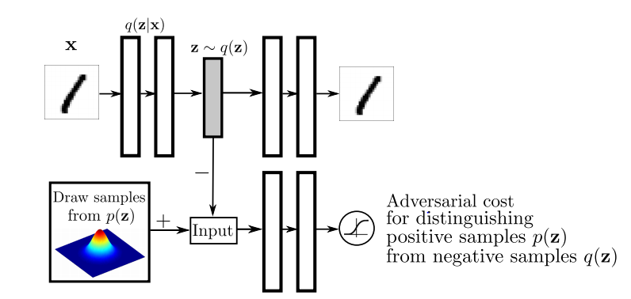 | The top row is an autoencoder. z is sampled through the re-parameterization trick discussed in [variational autoencoder paper](https://arxiv.org/abs/1312.6114). The bottom row is a discriminator to separate samples generate from the encoder and samples from the prior distribution p(z).

### Hyperparameters
*name* | *value* |
:---| :---|
Reconstruction Loss Weight | 1.0 |
Latent z G/D Loss Weight | 6.0 / 6.0 |
Batch Size | 128 |
Max Epoch | 400 |
Learning Rate | 2e-4 (initial) / 2e-5 (100 epochs) / 2e-6 (300 epochs)

### Usage

- Training. Summary, randomly sampled images and latent space during training will be saved in `SAVE_PATH`.

 ```
 python aae_mnist.py --train --ncode <CODE_DIM> --dist_type <TYPE_OF_PRIOR>
 ```
 
 - Random sample data from trained model. Image will be saved in `SAVE_PATH` with name `generate_im.png`.
 ```
 python aae_mnist.py --generate --ncode <CODE_DIM> --dist_type <TYPE_OF_PRIOR> --load <RESTORE_MODEL_ID>
 ```
 - Visualize latent space and data manifold (only when code dim = 2). Image will be saved in `SAVE_PATH` with name `generate_im.png` and `latent.png`. For Gaussian distribution, there will be one image for data manifold. For mixture of 10 2D Gaussian, there will be 10 images of data manifold for each component of the distribution.
 ```
 python aae_mnist.py --viz --ncode <CODE_DIM> --dist_type <TYPE_OF_PRIOR> --load <RESTORE_MODEL_ID>
 ```
 <!---
*name* | *command* 
:--- | :---
Training |``python aae_mnist.py --train --dist_type <TYPE_OF_PRIOR>``|
Random sample data |``python aae_mnist.py --generate --dist_type <TYPE_OF_PRIOR> --load <RESTORE_MODEL_ID>``|
Visualize latent space and data manifold (only when code dim = 2) |``python aae_mnist.py --viz --dist_type <TYPE_OF_PRIOR> --load <RESTORE_MODEL_ID>``|
Option | ``--bsize``
--->

### Result
- For 2D Gaussian, we can see sharp transitions (no gaps) as mentioned in the paper. Also, from the learned manifold, we can see almost all the sampled images are readable.
- For mixture of 10 Gaussian, I just uniformly sample images in a 2D square space as I did for 2D Gaussian instead of sampling along the axes of the corresponding mixture component, which will be shown in the next section. We can see in the gap area between two component, it is less likely to generate good samples.  

*Prior Distribution* | *Learned Coding Space* | *Learned Manifold*
:---: | :---: | :---: |
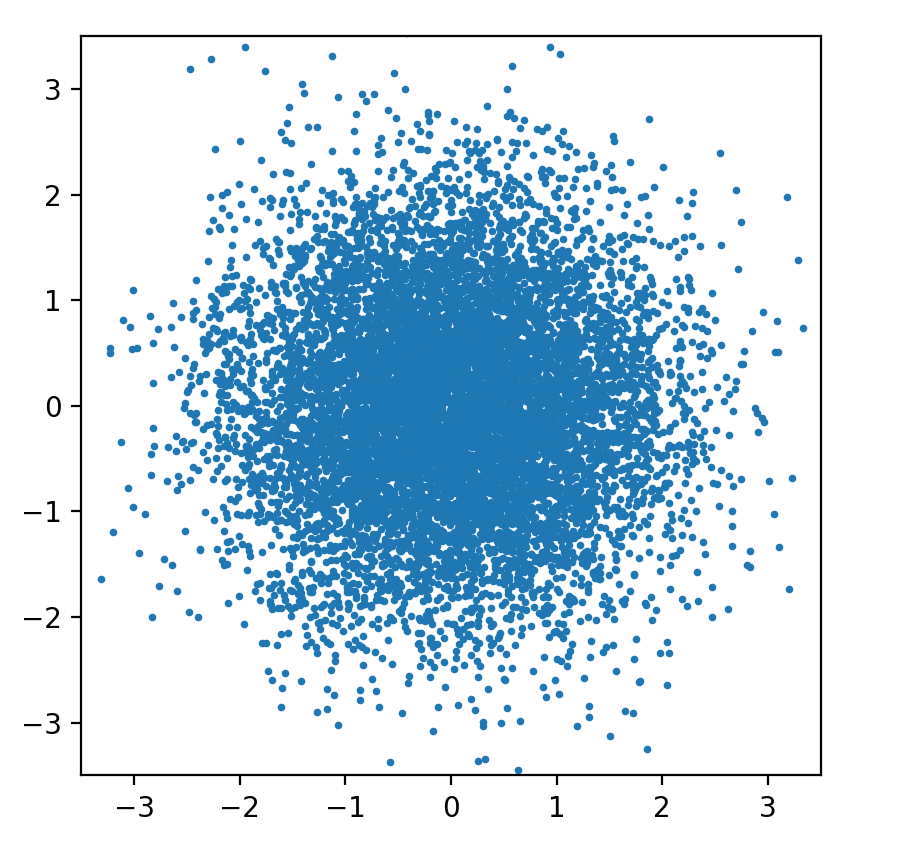 | 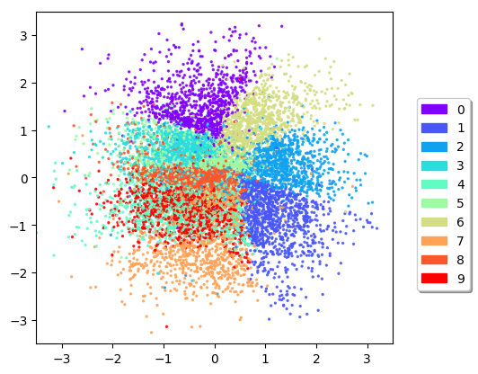 | 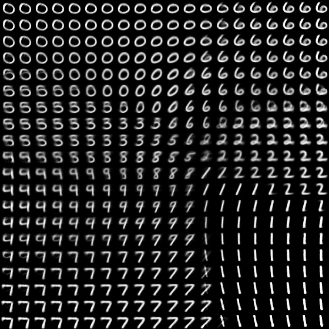
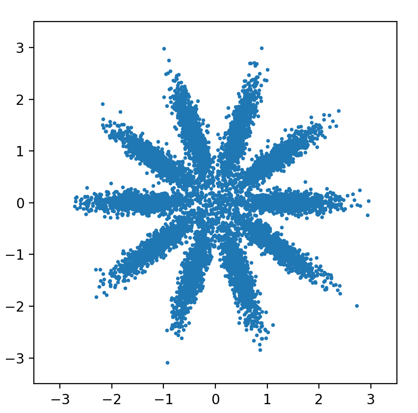 | 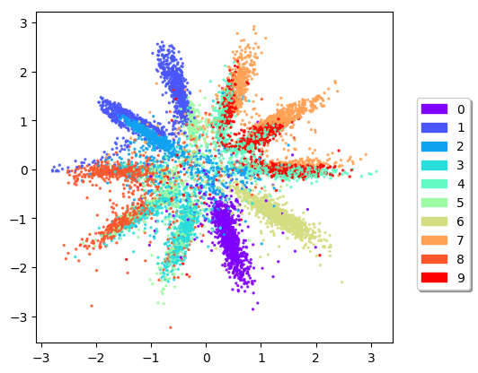 | 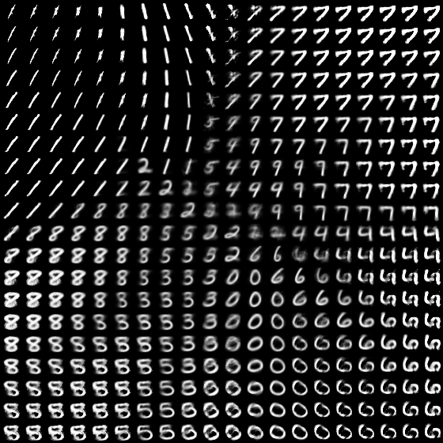

## 2. Incorporating label in the Adversarial Regularization

### Architecture
*Architecture* | *Description*
:---: | :--- |
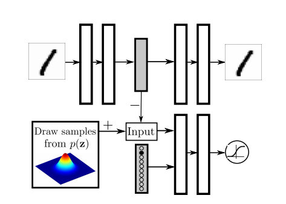 | The only difference from previous model is that the one-hot label is used as input of encoder and there is one extra class for unlabeled data. For mixture of Gaussian prior, real samples are drawn from each components for each labeled class and for unlabeled data, real samples are drawn from the mixture distribution.

### Hyperparameters
Hyperparameters are the same as previous section.

### Usage
- Training. Summary, randomly sampled images and latent space will be saved in `SAVE_PATH`.

 ```
 python aae_mnist.py --train --ncode <CODE_DIM> --label --dist_type <TYPE_OF_PRIOR>
 ```
 
- Random sample data from trained model. Image will be saved in `SAVE_PATH` with name `generate_im.png`.
 ```
 python aae_mnist.py --generate --ncode <CODE_DIM> --label --dist_type <TYPE_OF_PRIOR> --load <RESTORE_MODEL_ID>
 ```
 
- Visualize latent space and data manifold (only when code dim = 2). Image will be saved in `SAVE_PATH` with name `generate_im.png` and `latent.png`. For Gaussian distribution, there will be one image for data manifold. For mixture of 10 2D Gaussian, there will be 10 images of data manifold for each component of the distribution.
 ```
 python aae_mnist.py --viz --ncode <CODE_DIM> --label --dist_type <TYPE_OF_PRIOR> --load <RESTORE_MODEL_ID>
 ```
 ### Result
 - Compare with the result in the previous section, incorporating labeling information provides better fitted distribution for codes.
 - The learned manifold images demonstrate that each Gaussian component corresponds to the one class of digit. However, the style representation is not consistently represented within each mixture component as shown in the paper. For example, the right most column of the first row experiment, the lower right of digit 1 tilt to left while the lower right of digit 9 tilt to right.

*Number of Label Used* | *Learned Coding Space* | *Learned Manifold*
:--- | :---: | :---: |
**Use full label**| 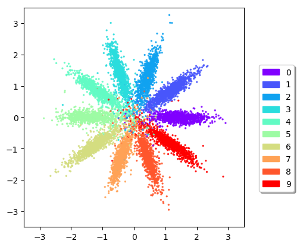 | 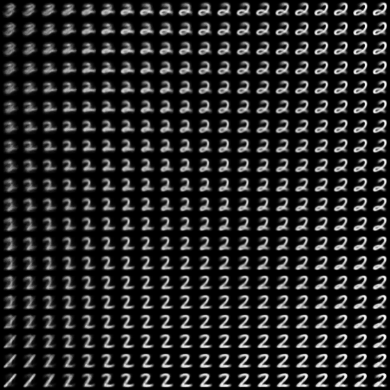 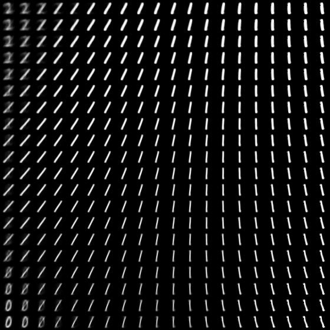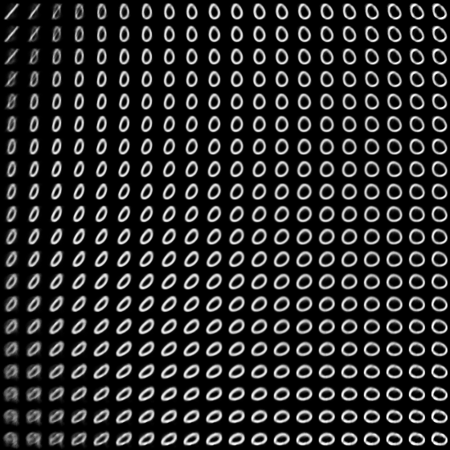 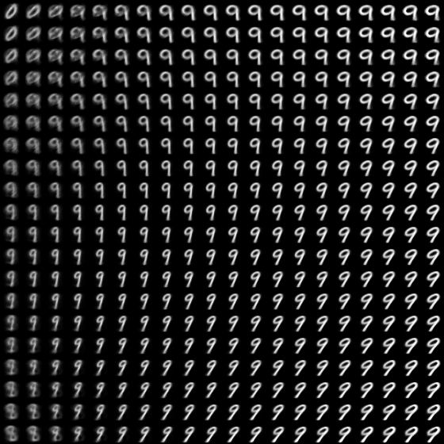
**10k labeled data and 40k unlabeled data** | 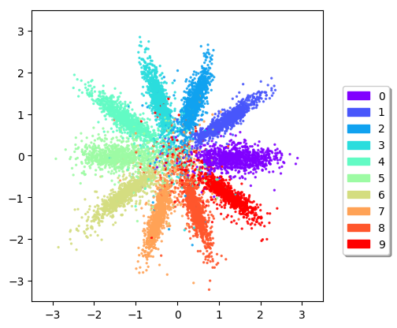 | 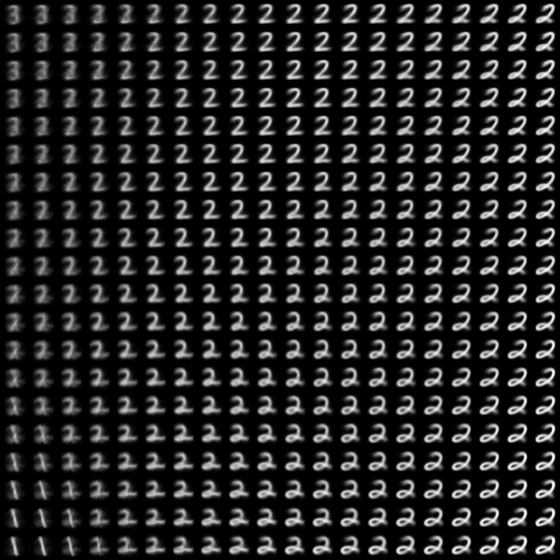 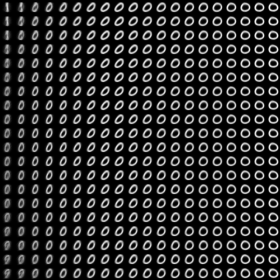 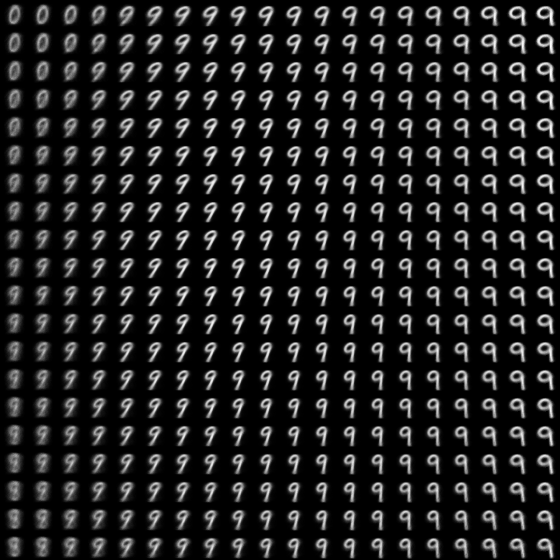

### 3. Supervised Adversarial Autoencoders

### Architecture
*Architecture* | *Description*
:---: | :--- |
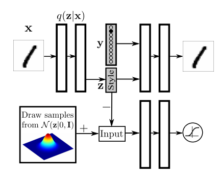 | The decoder takes code as well as a one-hot vector encoding the label as input. Then it forces the network learn the code independent of the label.

### Hyperparameters

### Usage
- Training. Summary and randomly sampled images will be saved in `SAVE_PATH`.

 ```
 python aae_mnist.py --ncode <CODE_DIM> --train_supervised
 ```
 
 - Random sample data from trained model. Image will be saved in `SAVE_PATH` with name `sample_style.png`.
 ```
 python aae_mnist.py --ncode <CODE_DIM> --generate --supervise --load <RESTORE_MODEL_ID>
 ```

### Result
- The result images are generated by using the same code for each column and the same digit label for each row.
- When code dimension is 2, we can see each column consists the same style clearly. But for dimension 10, we can hardly read some digits. Maybe there are some issues of implementation or the hyper-parameters are not properly picked, which makes the code still depend on the label. 

*Code Dim=2* | *Code Dim=10* | 
:---: | :---: | 
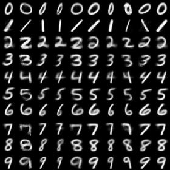| 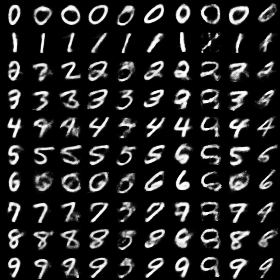|

### 4. Semi-supervised learning

### Architecture
*Architecture* | *Description*
:---: | :--- |
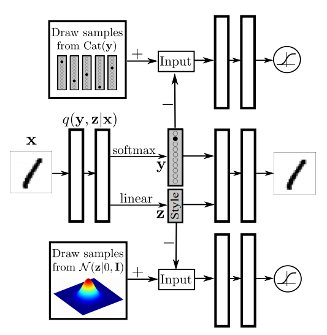 |  The encoder outputs code z as well as the estimated label y. Encoder again takes code z and one-hot label y as input. A Gaussian distribution is imposed on code z and a Categorical distribution is imposed on label y. In this implementation, the autoencoder is trained by semi-supervised classification phase every ten training steps when using 1000 label images and the one-hot label y is approximated by output of softmax.

### Hyperparameters
*name* | *value* |
:---| :---|
Dimention of z | 10 |
Reconstruction Loss Weight | 1.0 |
Letant z G/D Loss Weight | 6.0 / 6.0 |
Letant y G/D Loss Weight | 6.0 / 6.0 |
Batch Size | 128 |
Max Epoch | 250 |
Learning Rate | 1e-4 (initial) / 1e-5 (150 epochs) / 1e-6 (200 epochs)

### Usage
- Training. Summary will be saved in `SAVE_PATH`.

 ```
 python aae_mnist.py --ncode 10 --train_semisupervised --lr 2e-4 --maxepoch 250
 ```

### Result
- 1280 labels are used (128 labeled images per class)

learning curve for training set (computed only on the training set with labels)
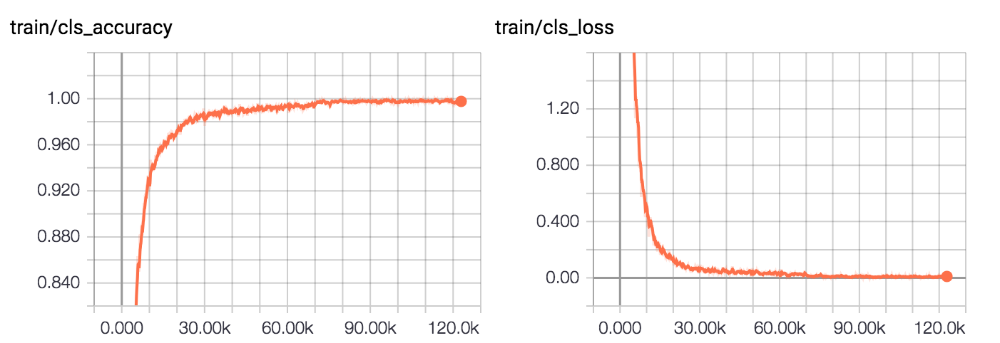

learning curve for testing set
- The accuracy on testing set is 97.10% around 200 epochs. 
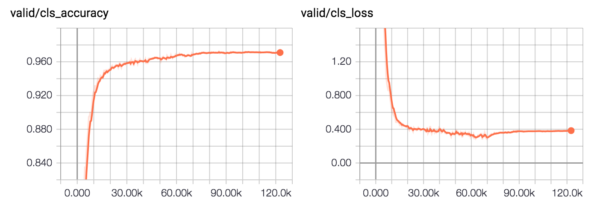


